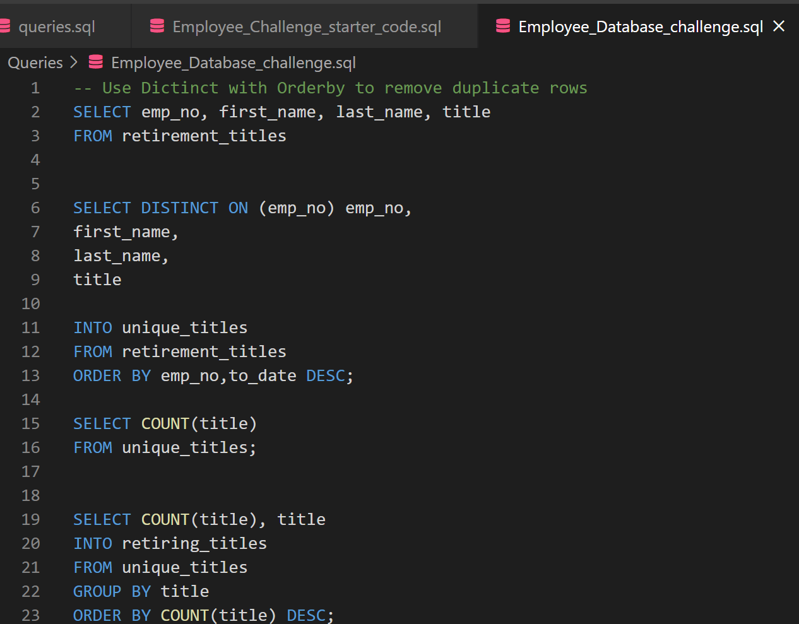
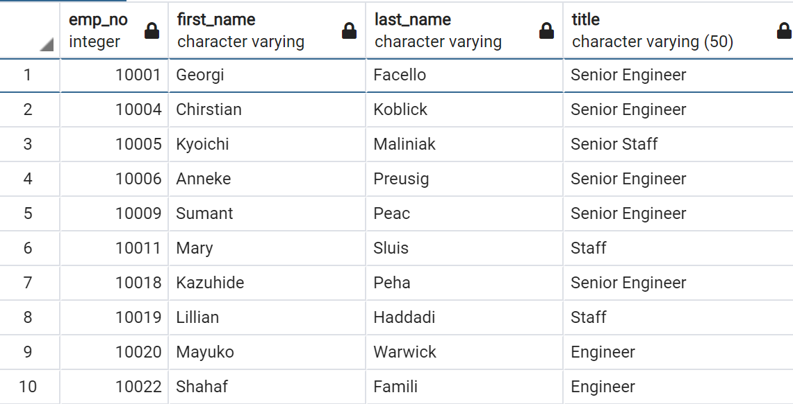

# Pewlett-Hackard-Analysis

# Overview

The purpose of the analysis is to perform employee research that answers these two questions

    a. How many employees will require a retirement package
    b. How many open positions will require to be filled after the retirements.

## Analysis

The task involved building an employee database with postgresql by applying data modelling, engineering and analysis.

### Results

    - I created Retirement Titles and Unique titles tables that holds all the titles of current employees who were born between January 1, 1952 and December 31, 1955 (Retirement titles).

    - I used **DISTINCT ON** statement to create a table (Unique titles) that contains the most recent title of each employee to avoid repititions. 
    Because some employees may have multiple titles in the database—for example, due to promotions

         
        

         

        
        

    -I created a mentorship_eligibility table that holds the current employees who were born between January 1, 1965 and December 31, 1965
    and who are eligible for the mentorship program put together by the  manager.

         

         

### Summary

    How many roles will need to be filled as the "silver tsunami" begins to make an impact?

        - SELECT COUNT(title) FROM unique_titles;
        Shows that there are 90398 roles will be retiring, the same number will be required to be filled

    Are there enough qualified, retirement-ready employees in the departments to mentor the next generation of Pewlett Hackard employees?

        - SELECT COUNT(title) FROM mentorship_eligibilty;
        Shows that there are 1549 are retirement-ready, as such there are not enugh qualified employees.
